# Daily Direction Algorithm (DDA) 

### *A Machine Learning Project to Predict a Cryptocurrency’s Positive/Negative Movement*

>**Hypothesis:** Can cryptocurrency on-chain data paired with technical indicators fit to a Machine Learning model be a reliable predictor of the next daily close? Is historical pricing the best indicator of a next day cryptocurrency price?

The three Proof of Work currencies selected for the purposes of this project are:
1. BTC
2. ETH
3. DASH

### Clean Up and Exploration
- Transposing and locating columns & rows
- Specify dtype
- Removing nulls
- Date Formatting
- Split() 
- Conditionally slicing data
- Statistics
- Concatenation

## Data Analysis
* We utilized two predictive models - The *Random Forest Regressor (RF)* for features analysis and the *Long Short-Term Memory Recurrent Neural Network (LSTM RNN)* for historical price comparison.

* We performed *backtesting* to compare the outcome of investing in a given currency with our model's value prediction for that currency as well as the opposite case scenario in which we would hold the currency instead of buying or selling it according to the model predictions.

____
### Bitcoin (BTC)

#### BTC LSTM Analysis
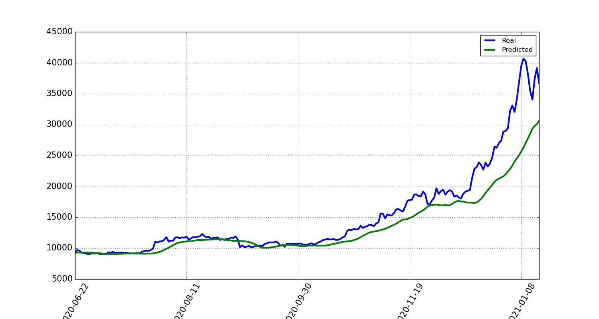

#### BTC Random Forest Test (Heat Map)
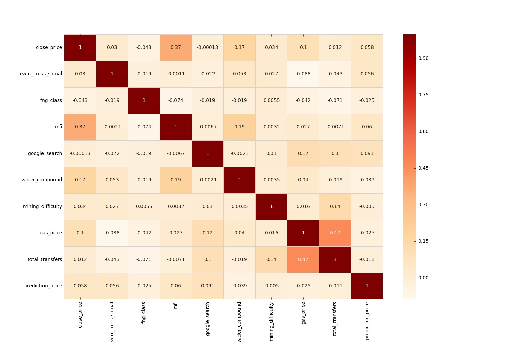
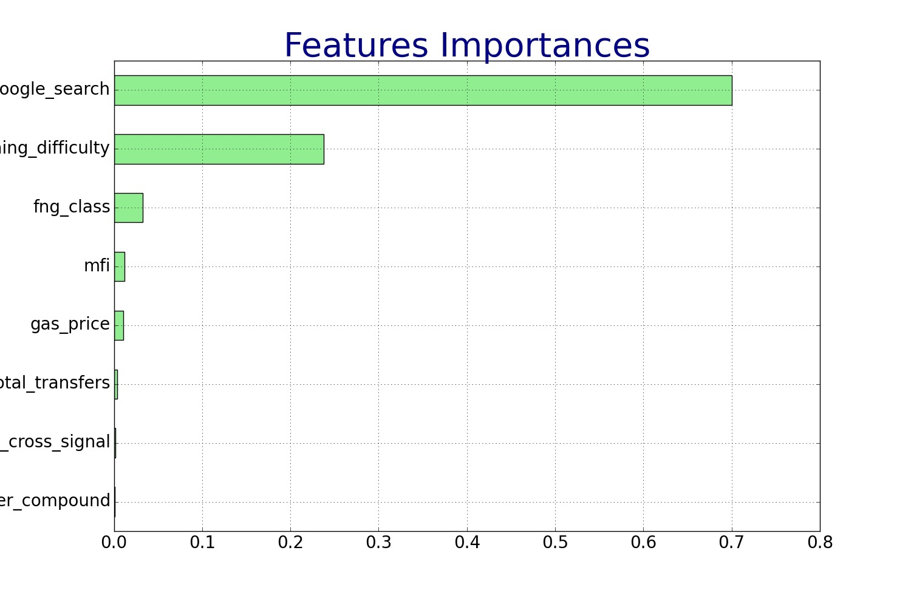

#### BTC Decision Tree
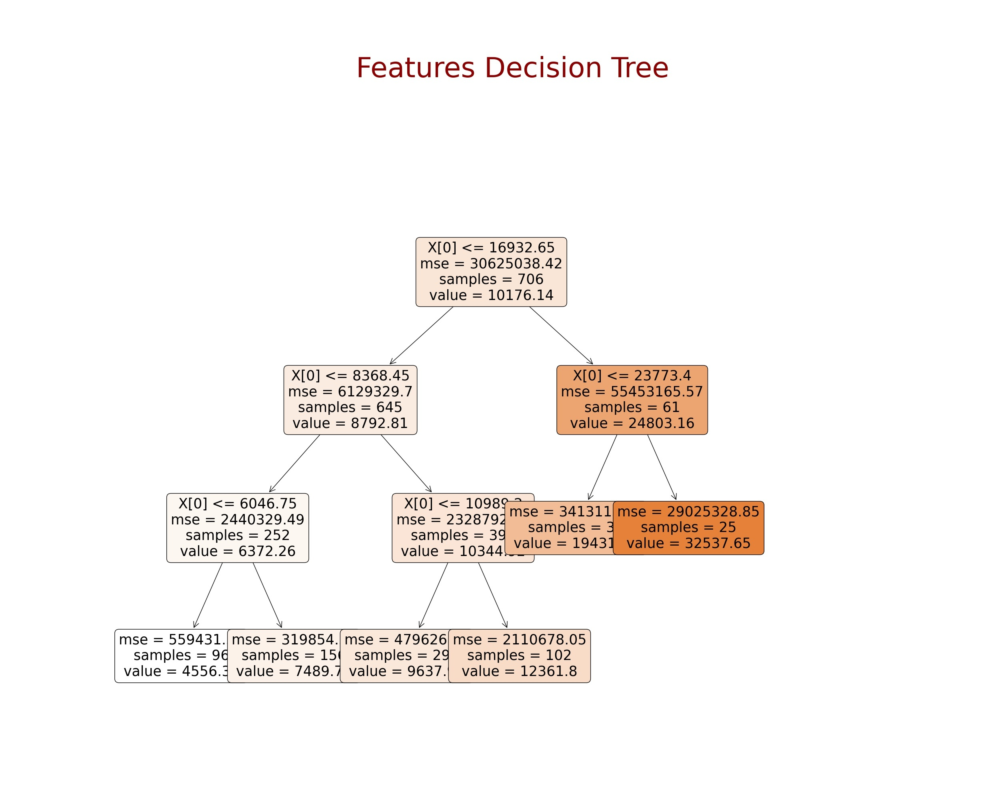

#### BTC Win Vs Lose
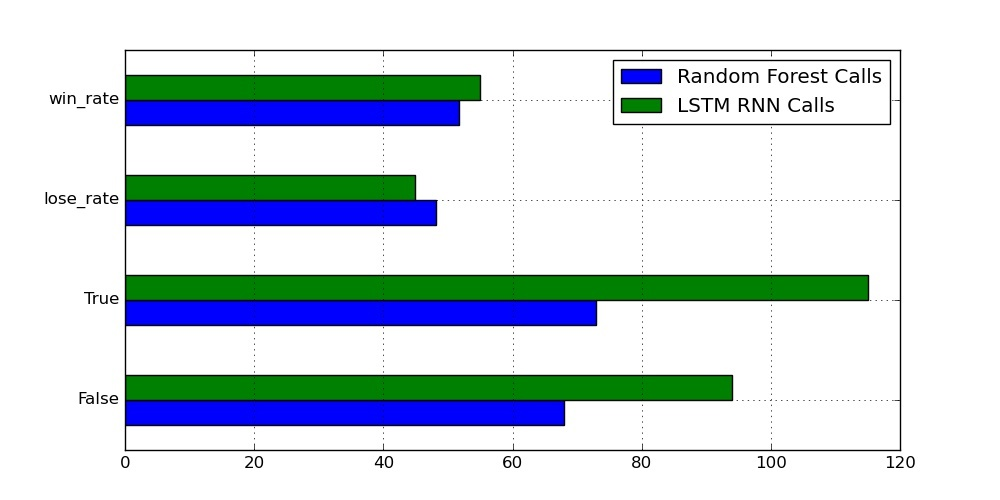
**Note.-**
* If the predicted price had a positive movement in price and the actual price had a positive movement in price then we had a TRUE CALL. 
* If the predicted price had a negative movement in price and the actual price had a negative movement then we again have a TRUE CALL.
* If though, the predicted price and the actual price had inverse movements then we would have a FALSE CALL.
* Win/Lose is the percentage change of the “true”/”false” call.

### Ethereum (ETH)

#### ETH LSTM Analysis
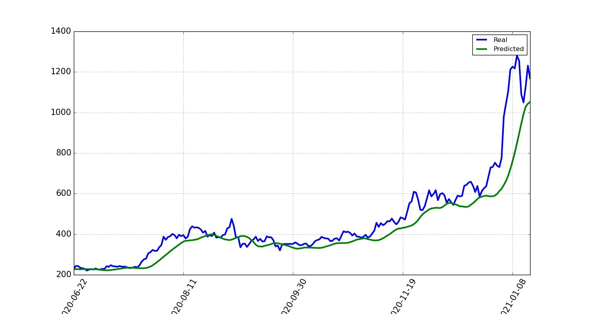

#### ETH Random Forest Test (Heat Map)
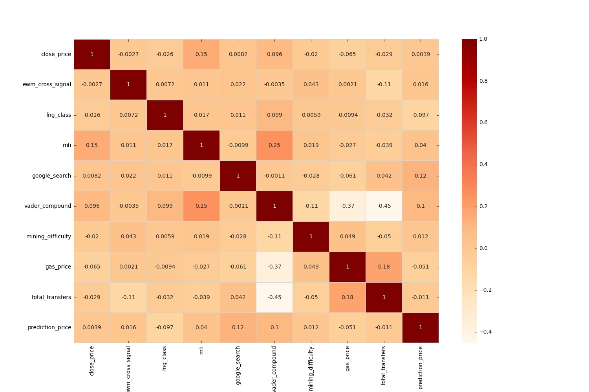
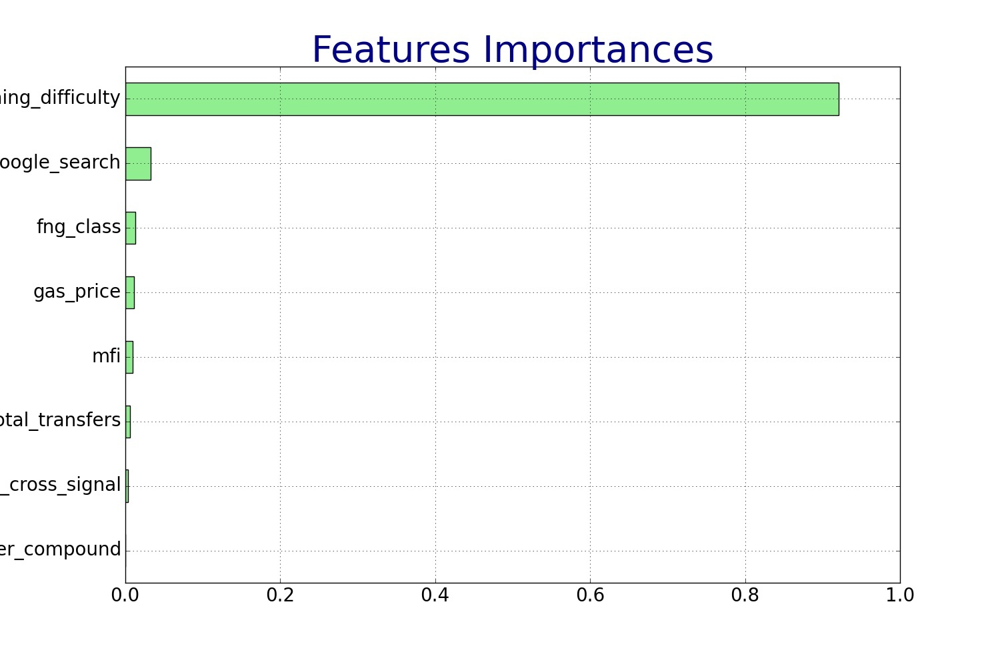

#### ETH Decision Tree
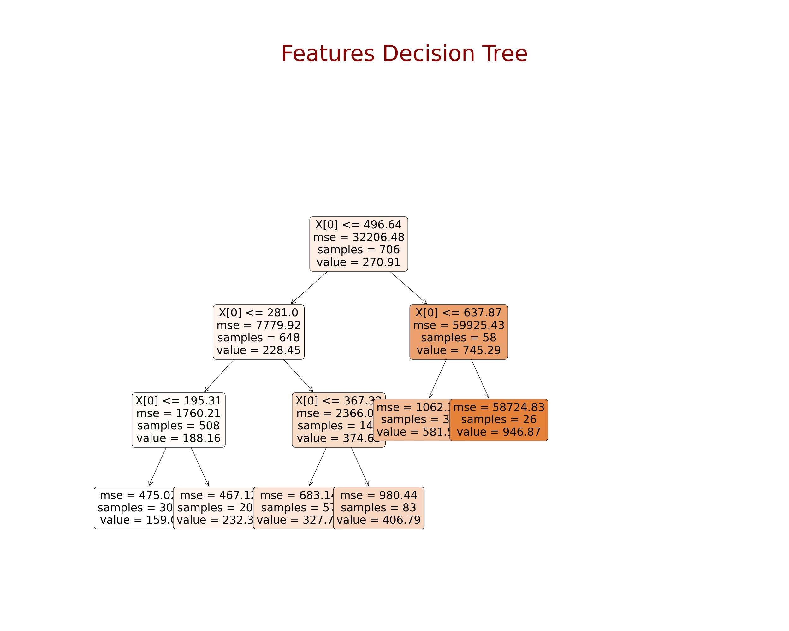

#### ETH Win Vs Lose
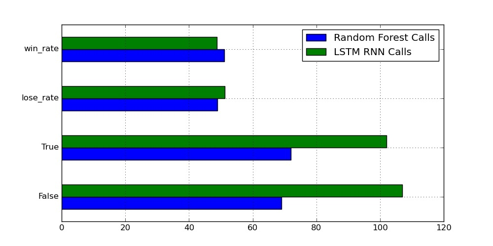
**Note.-**
* If the predicted price had a positive movement in price and the actual price had a positive movement in price then we had a TRUE CALL. 
* If the predicted price had a negative movement in price and the actual price had a negative movement then we again have a TRUE CALL.
* If though, the predicted price and the actual price had inverse movements then we would have a FALSE CALL.
* Win/Lose is the percentage change of the “true”/”false” call.

### DASH

#### DASH LSTM Analysis
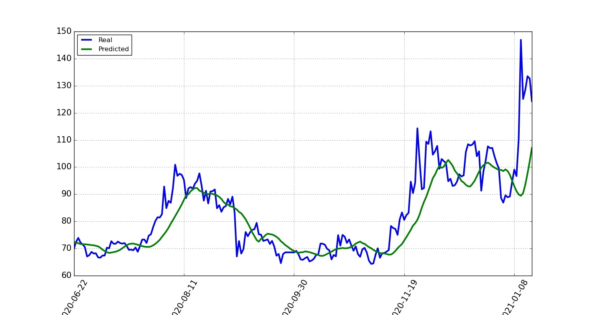

#### DASH Random Forest Test (Heat Map)
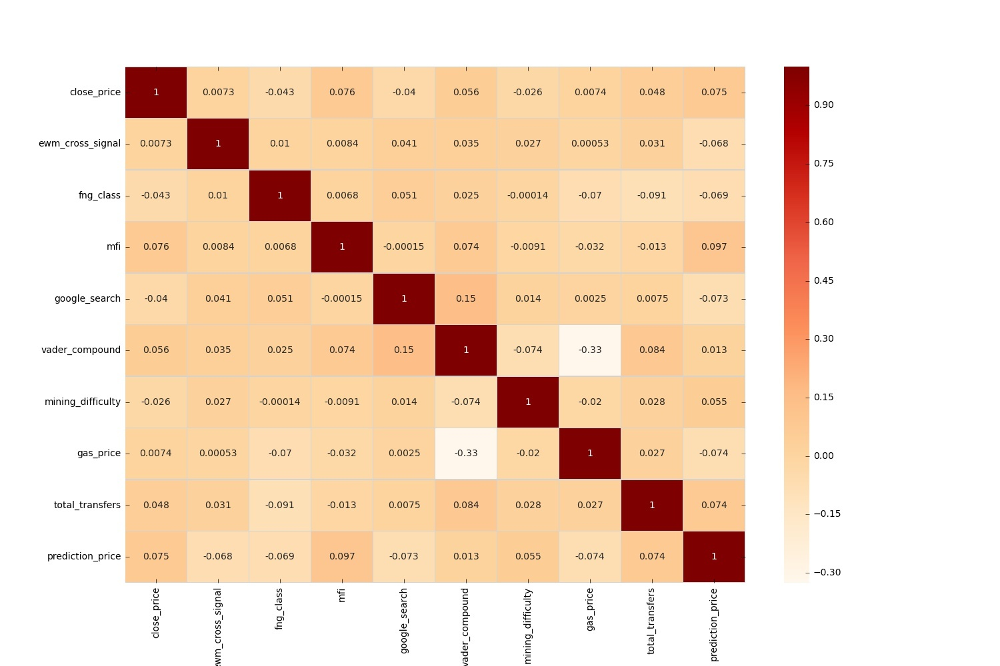
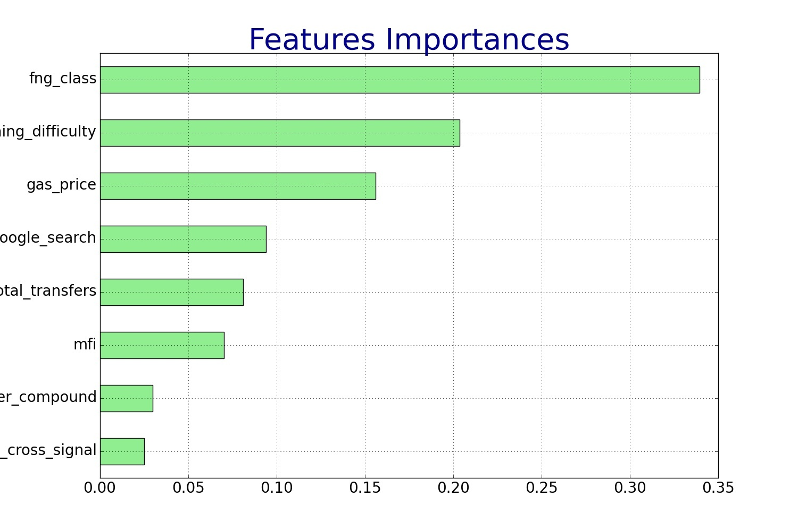

#### DASH Decision Tree
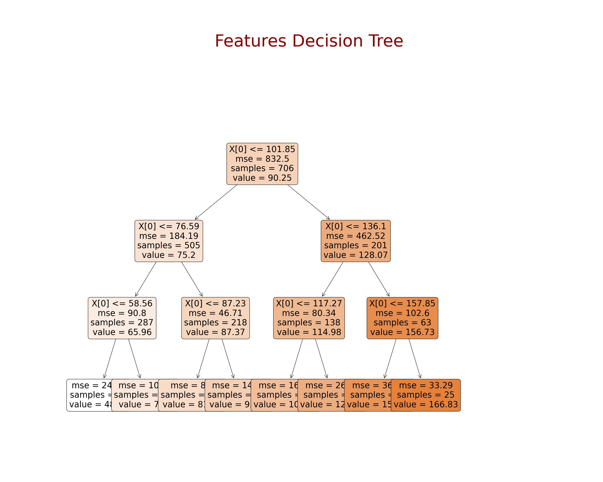

#### DASH Win Vs Lose
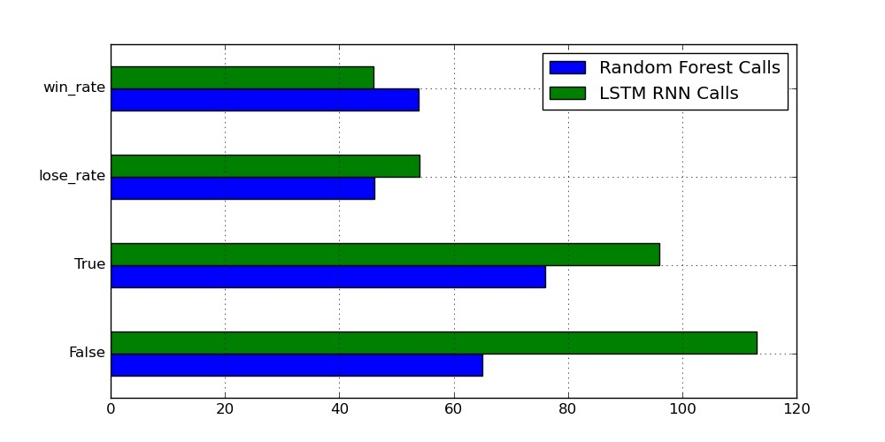
**Note.-**
* If the predicted price had a positive movement in price and the actual price had a positive movement in price then we had a TRUE CALL. 
* If the predicted price had a negative movement in price and the actual price had a negative movement then we again have a TRUE CALL.
* If though, the predicted price and the actual price had inverse movements then we would have a FALSE CALL.
* Win/Lose is the percentage change of the “true”/”false” call.

## To Discuss
____
- For the LSTM model, BTC had the higher win rate out of the three cryptocurrencies with a 55% win rate. 

- The random forest test, Dash got the higher win rate with a 54% win rate. 

- Overall, notice that for the Random Forest test the win rate is higher on all three coins tested. This means that through FR, we are able to get more reliable results.

- What the data showed or did not show: data validated our initial hypotheses, with some exceptions and caveats.

# Conclusions
____
- There are positive signs that various features are a better indicator than only closing price to predict crypto on a near future baisis.

- This test would need to run with more crypto currencies in order to create a higher reliability on the tool’s accuracy to predict this, but due to time constraints we did not include more currencies in the test.

## Sources
____

**[Google BigQuery](https://console.cloud.google.com/) (Google Cloud Platform):** Service platform that supports querying using ANSI SQL. Used to extract data on each currency such as mining difficulty, value, size, and the timestamp for each. 

**[Reddit_NLP](https://www.reddit.com/) (Reddit):** Used for sentiment Analysis through Natural Language Process. Reddit is a social news aggregation, web content rating, and discussion website.

**[Kraken API_Price](https://support.kraken.com/hc/en-us) (Kraken):** Used to encrypt our communication with the API.

**[MFI](https://randerson112358.medium.com/algorithmic-trading-strategy-using-money-flow-index-mfi-python-aa46461a5ea5) (MFI):** Playbook to calculate MFI data

**[Fear&Greed](https://alternative.me/crypto/fear-and-greed-index/) (Sentiment):** Patform for optimizing connections between a variety of software and product alternatives.

| Project by |
|-----------:|
| Cathy Slider |
| Jeff Myers |
| Collin Holben |
| Andrea Asbun |

